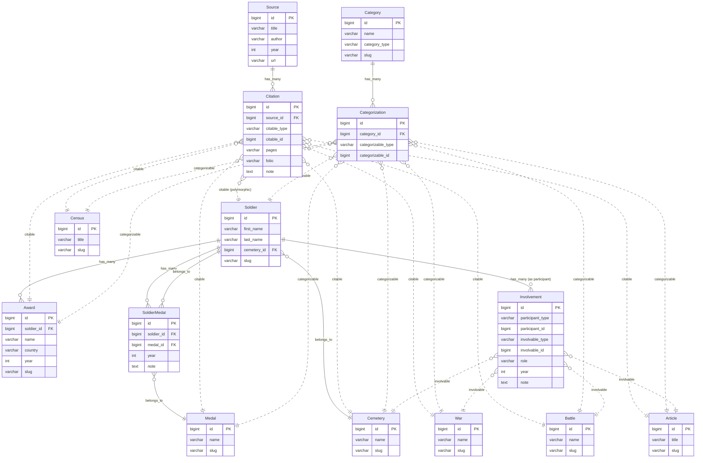

```mermaid
erDiagram
  Soldier {
    bigint id PK
    varchar first_name
    varchar last_name
    bigint cemetery_id FK
    varchar slug
  }

  Award {
    bigint id PK
    bigint soldier_id FK
    varchar name
    varchar country
    int year
    varchar slug
  }

  Medal {
    bigint id PK
    varchar name
    varchar slug
  }

  SoldierMedal {
    bigint id PK
    bigint soldier_id FK
    bigint medal_id FK
    int year
    text note
  }

  Involvement {
    bigint id PK
    varchar participant_type
    bigint participant_id
    varchar involvable_type
    bigint involvable_id
    varchar role
    int year
    text note
  }

  War {
    bigint id PK
    varchar name
    varchar slug
  }

  Battle {
    bigint id PK
    varchar name
    varchar slug
  }

  Cemetery {
    bigint id PK
    varchar name
    varchar slug
  }

  Article {
    bigint id PK
    varchar title
    varchar slug
  }

  Census {
    bigint id PK
    varchar title
    varchar slug
  }

  Source {
    bigint id PK
    varchar title
    varchar author
    int year
    varchar url
  }

  Citation {
    bigint id PK
    bigint source_id FK
    varchar citable_type
    bigint citable_id
    varchar pages
    varchar folio
    text note
  }

  Category {
    bigint id PK
    varchar name
    varchar category_type
    varchar slug
  }

  Categorization {
    bigint id PK
    bigint category_id FK
    varchar categorizable_type
    bigint categorizable_id
  }

  %% --- Direct (non-poly) relations
  Soldier ||--o{ Award : "has_many"
  Soldier ||--o{ SoldierMedal : "has_many"
  Soldier }o--|| Cemetery : "belongs_to"
  SoldierMedal }o--|| Soldier : "belongs_to"
  SoldierMedal }o--|| Medal   : "belongs_to"

  Source ||--o{ Citation : "has_many"
  Category ||--o{ Categorization : "has_many"

  %% --- Polymorphic relations (dashed annotations)
  %% Citations (citable)
  Citation }o..|| Soldier : "citable (polymorphic)"
  Citation }o..|| Award   : "citable"
  Citation }o..|| Medal   : "citable"
  Citation }o..|| War     : "citable"
  Citation }o..|| Battle  : "citable"
  Citation }o..|| Cemetery: "citable"
  Citation }o..|| Article : "citable"
  Citation }o..|| Census  : "citable"

  %% Categorizations (categorizable)
  Categorization }o..|| Soldier : "categorizable"
  Categorization }o..|| Award   : "categorizable"
  Categorization }o..|| Medal   : "categorizable"
  Categorization }o..|| War     : "categorizable"
  Categorization }o..|| Battle  : "categorizable"
  Categorization }o..|| Cemetery: "categorizable"
  Categorization }o..|| Article : "categorizable"
  Categorization }o..|| Census  : "categorizable"

  %% Involvements
  Soldier ||--o{ Involvement : "has_many (as participant)"
  Involvement }o..|| War     : "involvable"
  Involvement }o..|| Battle  : "involvable"
  Involvement }o..|| Cemetery: "involvable"
  Involvement }o..|| Article : "involvable"
```